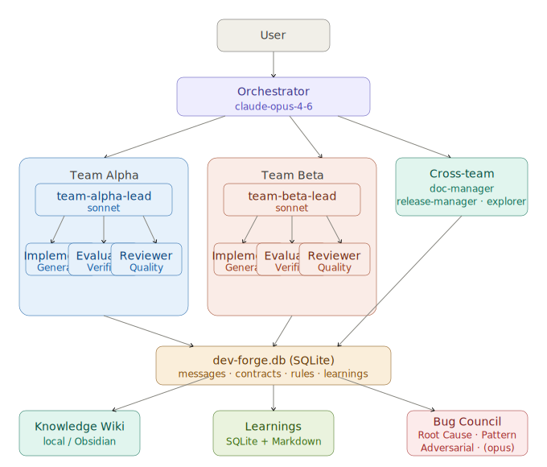

# dev-forge

A Claude Code plugin for SQLite-backed multi-agent development team orchestration with wiki knowledge management, learnings capture, and automatic bug council escalation.

## What is dev-forge?

dev-forge assembles an AI-powered development team where an Orchestrator delegates tasks to specialized agents — implementers, reviewers, evaluators, doc managers, and release managers — all coordinated via sprint contracts and a strict chain of command. Unlike its predecessor `devteam`, dev-forge uses **SQLite as the single message bus**, eliminating file-based message queues in favor of atomic, concurrent-safe database writes.

## Key Features

- **SQLite message bus**: All inter-agent communication goes through `.dev-forge/dev-forge.db`. No scattered inbox files.
- **Sprint Contracts**: Pre-agreed acceptance criteria before implementation begins. Eliminates ambiguous handoffs.
- **Generator/Evaluator pattern**: Implementer and Evaluator are always separate agents — no self-evaluation bias.
- **Model Escalation**: Automatically upgrades agent models on repeated failures (Sonnet → Opus → Bug Council).
- **Bug Council**: 3-analyst multi-perspective diagnosis triggered at 6 consecutive failures or critical bugs.
- **Knowledge Wiki**: Karpathy-style LLM wiki for project knowledge accumulation.
- **Learnings capture**: Mistakes and patterns recorded to SQLite, queryable by future agents.
- **Dynamic teams**: Add/remove teams and agents at runtime without full restart.
- **Cross-platform**: macOS, Linux, and Windows (PowerShell) support.

## Prerequisites

| Requirement | macOS/Linux | Windows |
|---|---|---|
| `sqlite3` CLI | `brew install sqlite3` | `winget install SQLite.SQLite` |
| `tmux` | `brew install tmux` | Use Windows Terminal (`wt`) |
| `claude` CLI | [Claude Code](https://claude.ai/code) | Same |

## Installation

```bash
/plugin marketplace add yn01/claude-plugins
/plugin install dev-forge
```

## Quick Start

1. Copy the configuration template to your project root:
   ```bash
   cp $(claude plugin path dev-forge)/templates/devforge.yaml ./devforge.yaml
   ```

2. (Optional) Edit `devforge.yaml` to customize team names and models.

3. Start the dev-forge team:
   ```
   /dev-forge:start
   ```

4. Create your first sprint contract:
   ```
   /dev-forge:contract create team-alpha-lead "Implement user authentication with JWT"
   ```

5. Monitor progress:
   ```
   /dev-forge:status
   ```

6. When done, stop all agents:
   ```
   /dev-forge:stop
   ```

## Command Reference

| Command | Description |
|---|---|
| `/dev-forge:start` | Initialize SQLite DB and launch all agent sessions |
| `/dev-forge:stop` | Stop all agents, archive unread messages |
| `/dev-forge:status` | Dashboard: agent status, message queue, contracts |
| `/dev-forge:send <agent> <msg>` | Send a message to a specific agent |
| `/dev-forge:export [--section <s>]` | Export DB contents to Markdown files |
| `/dev-forge:contract create <lead> "<task>"` | Create a sprint contract |
| `/dev-forge:contract list [filter]` | List contracts with optional status filter |
| `/dev-forge:contract complete <id>` | Mark a contract as completed |
| `/dev-forge:contract report` | Sprint summary report |
| `/dev-forge:team add <name>` | Add a new team |
| `/dev-forge:team remove <name>` | Remove a team |
| `/dev-forge:team list` | List all teams |
| `/dev-forge:agent add <team> <template>` | Add a specialist agent to a team |
| `/dev-forge:agent remove <team> <id>` | Remove an agent from a team |
| `/dev-forge:route add <from> <to>` | Add a communication route |
| `/dev-forge:route remove <from> <to>` | Remove a communication route |
| `/dev-forge:route list` | List all communication routes |
| `/dev-forge:route save` | Sync routes back to `devforge.yaml` |
| `/dev-forge:wiki ingest <file-or-url>` | Add a source to the wiki |
| `/dev-forge:wiki query <terms>` | Search the wiki |
| `/dev-forge:wiki lint` | Check wiki for issues |
| `/dev-forge:guideline add "<title>" "<content>"` | Add a coding guideline |
| `/dev-forge:guideline list` | List all guidelines |
| `/dev-forge:learn` | Record learnings from the current iteration |
| `/dev-forge:learn review` | Browse accumulated learnings |
| `/dev-forge:learn export` | Export all learnings to Markdown |

## Customizing devforge.yaml

### Adding a team

```yaml
teams:
  - name: gamma           # Add this block
    lead:
      model: claude-sonnet-4-6
      can_contact: [orchestrator, doc-manager, implementer-gamma, evaluator-gamma, reviewer-gamma]
    members:
      - id: implementer-gamma
        role: implementer
        model: claude-sonnet-4-6
        can_contact: [team-gamma-lead, evaluator-gamma, reviewer-gamma]
```

Or dynamically:
```
/dev-forge:team add gamma
```

### Adding a specialist agent

```
/dev-forge:agent add alpha security-auditor
```

Available templates: `security-auditor`, `performance-analyst`, `devops-engineer`, `doc-writer`

### Changing communication routes

```
/dev-forge:route add doc-manager team-gamma-lead
/dev-forge:route save
```

## Architecture



```
User
 │
 └── Orchestrator (claude-opus-4-6)
     ├── doc-manager (sonnet)
     ├── release-manager (sonnet)
     ├── explorer (haiku)
     ├── team-alpha-lead (sonnet)
     │   ├── implementer-alpha (sonnet)   <- Generator
     │   ├── evaluator-alpha (sonnet)     <- Evaluator
     │   └── reviewer-alpha (sonnet)      <- Quality
     └── team-beta-lead (sonnet)
         ├── implementer-beta (sonnet)
         ├── evaluator-beta (sonnet)
         └── reviewer-beta (sonnet)

All communication -> .dev-forge/dev-forge.db (SQLite)

Bug Council (triggered at 6+ failures):
  bug-council-orchestrator (opus)
  ├── root-cause-analyst (sonnet)
  ├── pattern-matcher (sonnet)
  └── adversarial-tester (sonnet)
```

## Why SQLite Instead of File-Based Queues?

The predecessor `devteam` plugin uses Markdown files in inbox directories. dev-forge replaces this with SQLite for several reasons:

1. **Atomic writes**: SQLite's WAL mode prevents race conditions when multiple agents write simultaneously.
2. **Queryability**: `SELECT`, `WHERE`, `GROUP BY` — no need to parse filenames or scan directories.
3. **Audit trail**: `violation_log`, `learnings`, and `agent_status` tables give a full audit trail in one place.
4. **Human-readable export**: `/dev-forge:export` converts the DB to Markdown when human review is needed.
5. **Single file**: One `.dev-forge/dev-forge.db` file to back up, restore, or share.

## Wiki and Learnings

### Wiki

The wiki stores project knowledge as Markdown files in `.dev-forge/wiki/`. Agents can reference it before starting tasks. Humans manage it via `/dev-forge:wiki ingest`.

For Obsidian users, set `wiki.storage: obsidian` and `wiki.obsidian_vault: /path/to/vault` in `devforge.yaml`.

### Learnings

After each sprint iteration (especially evaluator PASS events), the `post-tool-use` hook suggests recording a learning. Learnings are stored in SQLite and mirrored to `.dev-forge/learnings/LEARNINGS.md`. The `pattern-matcher` Bug Council agent queries learnings when diagnosing failures.

## Directory Structure

```
.dev-forge/                    <- Created in your project root by /dev-forge:start
├── dev-forge.db               <- SQLite database (messages, contracts, agents, rules, learnings)
├── wiki/                      <- Knowledge wiki (Markdown files)
├── learnings/                 <- Iteration learnings (Markdown + mirrored from SQLite)
├── guidelines/                <- Coding guidelines (human-managed zone)
├── archive/                   <- Archived messages from /dev-forge:stop
└── export/                    <- Exports from /dev-forge:export
```

## Windows Support

dev-forge supports Windows via PowerShell equivalents for all shell hooks. When running on Windows:

- Use `sqlite3.exe` (install via `winget install SQLite.SQLite`)
- Agent sessions use Windows Terminal (`wt`) instead of tmux
- All hook scripts have `.ps1` counterparts in `hooks/`
- Path separators use `\` in PowerShell commands

## Changelog

### v1.0.0 — 2026-04-07
- Initial release
- SQLite-backed message bus replacing file-based queues
- Multi-team orchestration with dynamic team/agent management
- Sprint Contracts with acceptance criteria
- Generator/Evaluator pattern
- Model escalation (2 → 4 → 6 failure thresholds)
- Bug Council with 3-analyst diagnosis
- Knowledge Wiki with local and Obsidian storage backends
- Agent Learnings with SQLite storage and Markdown export
- Lifecycle hooks (SessionStart, Stop, PreToolUse, PostToolUse, PreCompact) with macOS/Linux and Windows support
- Communication rules enforcement with violation logging
