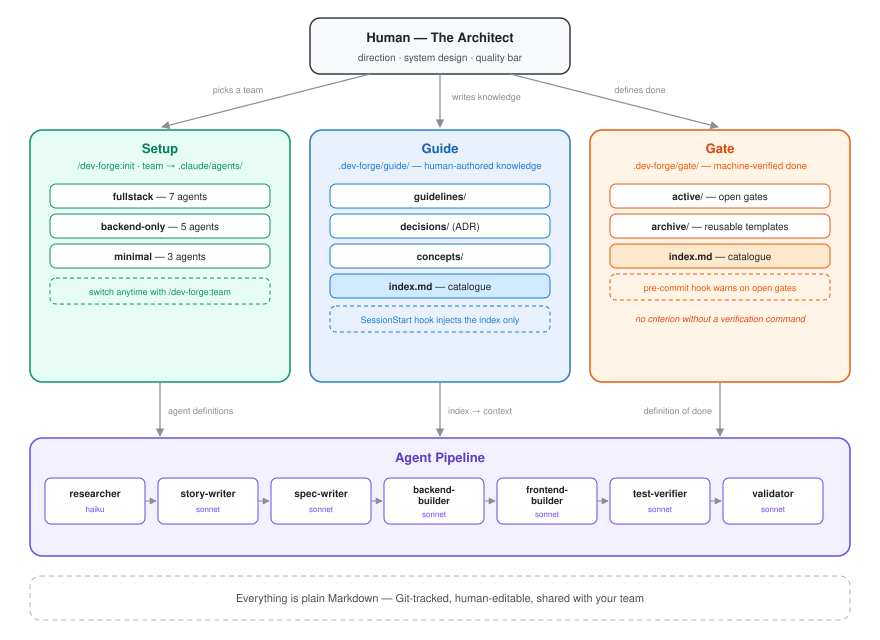

# dev-forge

**Human As The Architect** — an integrated Claude Code plugin that gives humans the systems they need to stay in the designer's seat while AI agents build.

<p align="center">
  
</p>

dev-forge bundles three capabilities in one plugin:

| Capability | What it does |
|------------|-------------|
| **Setup** | Places agent team templates in `.claude/agents/` so the development pipeline is ready in under a minute |
| **Guide** | Stores your guidelines, design decisions, and domain concepts; injects the catalogue automatically at every session start |
| **Gate** | Turns your completion criteria into machine-verifiable pass/fail checks with executable commands |

---

## Human As The Architect

AI agents are good at execution. Humans are good at direction. dev-forge structures the relationship so each side does what it is good at.

| Human (Architect) | AI (Agents) |
|-------------------|-------------|
| Decide what to build and why | Execute each stage of the development pipeline |
| Define guidelines and process (Guide) | Reference the human's policies at session start |
| Set quality criteria (Gate) | Run the verification commands the human defined |
| Intervene when AI cannot decide | Ask when a decision exceeds their mandate |
| Reflect learnings back into guidelines | Operate within the boundaries the human set |

---

## Why not just use CLAUDE.md / Skills / /goal?

### Guide vs CLAUDE.md

`CLAUDE.md` is read in full at every session start. It works well for short, universal instructions (50–150 lines) but becomes unwieldy as a project grows.

Guide is a structured extension: knowledge is split into topic-focused pages, only the index (a short catalogue) is injected at session start, and individual pages are fetched on demand. This keeps the context window lean while preserving the full knowledge base.

### Guide vs Skills

Skills define reusable workflows and procedures — how to run tests, how to deploy, how to format a PR. They are generic across projects.

Guide stores project-specific knowledge: *this project's* API design rules, *this project's* decision to use JWT, *this project's* definition of "Tenant". It is human-authored and project-scoped, not a reusable skill.

### Gate vs /goal

`/goal` sets a completion target for the current session. It lives in the conversation and disappears when the session ends.

Gate definitions are Markdown files: they persist across sessions, accumulate into a searchable library of reusable criteria, and can be committed to the repository so the whole team shares the same definition of done.

---

## Installation

```
/plugin marketplace add yn01/claude-plugins
/plugin install dev-forge
```

---

## Quick Start

```
# 1. Initialize project structure and place agent team
/dev-forge:init

# 2. Add your first guideline
/dev-forge:guide add guideline "API Design Rules"
# → opens .dev-forge/guide/guidelines/api-design-rules.md
# → fill in the rules, rationale, and examples

# 3. Define completion criteria for your next task
/dev-forge:gate define "Implement User Authentication"
# → opens .dev-forge/gate/active/GATE-<id>-implement-user-authentication.md
# → fill in criteria with verification commands

# 4. Develop with agents
# Agents read .dev-forge/guide/index.md at session start
# Agents reference gate criteria as their definition of done

# 5. Verify completion
/dev-forge:gate verify
# → runs all verification commands, archives passed gates
```

---

## Command Reference

### Setup

| Command | Description |
|---------|-------------|
| `/dev-forge:init` | Initialize `.dev-forge/` directories and place agent team templates |
| `/dev-forge:team <preset>` | Place or replace agent team templates; presets: `fullstack`, `backend-only`, `minimal` |

### Guide

| Command | Description |
|---------|-------------|
| `/dev-forge:guide add <category> "<title>"` | Create a new knowledge page (`guideline` / `decision` / `concept`) |
| `/dev-forge:guide list [category]` | List registered knowledge pages |
| `/dev-forge:guide query <question>` | Search the knowledge base with a natural language question |
| `/dev-forge:guide inject <topic>` | Load topic-specific pages into the current context |

### Gate

| Command | Description |
|---------|-------------|
| `/dev-forge:gate define "<task title>"` | Create a new gate definition file |
| `/dev-forge:gate verify [gate-id]` | Run verification commands; archive on full pass |
| `/dev-forge:gate list [status]` | List gates (`open` / `passed` / `failed` / `all`; default: `open`) |
| `/dev-forge:gate template [keyword]` | Search archived gates for reusable criteria |

---

## Team Presets

### fullstack — 7 agents

Full pipeline for projects with distinct frontend and backend layers.

| Agent | Role | Tools | Model |
|-------|------|-------|-------|
| researcher | Codebase investigation; maps files, patterns, risks | Read, Grep, Glob | claude-haiku-4-5-20251001 |
| story-writer | User stories + acceptance criteria | Read | claude-sonnet-4-6 |
| spec-writer | Technical specification from stories | Read, Grep, Glob | claude-sonnet-4-6 |
| backend-builder | API + business logic; backend folders only | Read, Write, Edit, Bash, Grep, Glob | claude-sonnet-4-6 |
| frontend-builder | UI; consumes backend APIs as-is | Read, Write, Edit, Bash, Grep, Glob | claude-sonnet-4-6 |
| test-verifier | Acceptance tests; no production code changes | Read, Write, Edit, Bash | claude-sonnet-4-6 |
| validator | Audits impl vs stories/spec; reports gaps by severity | Read, Grep, Glob | claude-sonnet-4-6 |

### backend-only — 5 agents

researcher · story-writer · spec-writer · backend-builder · validator

### minimal — 3 agents

researcher · builder (backend + frontend) · validator

Each agent reads `.dev-forge/guide/index.md` before starting work and consults gate criteria as the definition of done.

---

## Gate Definition Format

```markdown
# Implement User Authentication

## Gate ID

GATE-20260601-120000

## Status

open

## Task Description

Add JWT-based login and logout to the API.

## Completion Criteria

### Criterion 1: Unit tests pass

\`\`\`bash
npm test -- --grep "auth"
\`\`\`

Expected: exit code 0

### Criterion 2: Coverage meets threshold

\`\`\`bash
npx c8 report --check-coverage --lines 85
\`\`\`

Expected: exit code 0

## Verification Results

| Criterion | Result | Output |
|---|---|---|
| 1 | - | - |
| 2 | - | - |
```

Every criterion must include a verification command. A criterion without a command cannot be defined — this structurally eliminates ambiguous "done" definitions.

---

## Project Directory Structure

After running `/dev-forge:init`, your project will contain:

```
.dev-forge/
├── guide/
│   ├── guidelines/      # Coding standards, technical policies
│   ├── decisions/       # Design decisions (ADR format)
│   ├── concepts/        # Project-specific terms and domain concepts
│   └── index.md         # Catalogue — injected at session start
└── gate/
    ├── active/          # Gates currently in progress
    ├── archive/         # Passed gates (searchable as templates)
    └── index.md         # Gate catalogue

.claude/
└── agents/              # Agent definition files (placed by init/team)
```

---

## Changelog

### v3.0.2

- Fix hardcoded hook paths — `SessionStart` and `PreToolUse(Bash)` hooks referenced a fixed `3.0.0/` cache directory, so the guide auto-injection and pre-commit gate warning silently stopped working after any version bump. Paths now use the version-independent `${CLAUDE_PLUGIN_ROOT}` variable.

### v3.0.1

- Add architecture diagram to README

### v3.0.0

**Integrated release.** dev-forge, dev-guide, and dev-gate are now a single plugin.

- **Setup**: unchanged from v2 — `init` and `team` commands with fullstack/backend-only/minimal presets
- **Guide** (formerly `dev-guide` v1.0.x): `add`, `list`, `query`, `inject` — knowledge base moved to `.dev-forge/guide/`
- **Gate** (formerly `dev-gate` v1.0.x): `define`, `verify`, `list`, `template` — gate files moved to `.dev-forge/gate/`
- Removed: dependency on sister plugins; all functionality self-contained
- Removed: tmux session management, SQLite message queue, Project Manager agent, Bug Council, communication rules, violation logs, devforge.yaml, model escalation, learnings — these were carried from v1 and are now handled by Claude Code's native agent infrastructure

### v2.0.2

Starter kit for the Human As The Architect workflow — checked dev-guide and dev-gate installation, initialized their project directories, placed agent team presets.

### v1.x

SQLite-backed multi-agent development team with wiki, learnings, bug council escalation, tmux session management, and communication rules.
