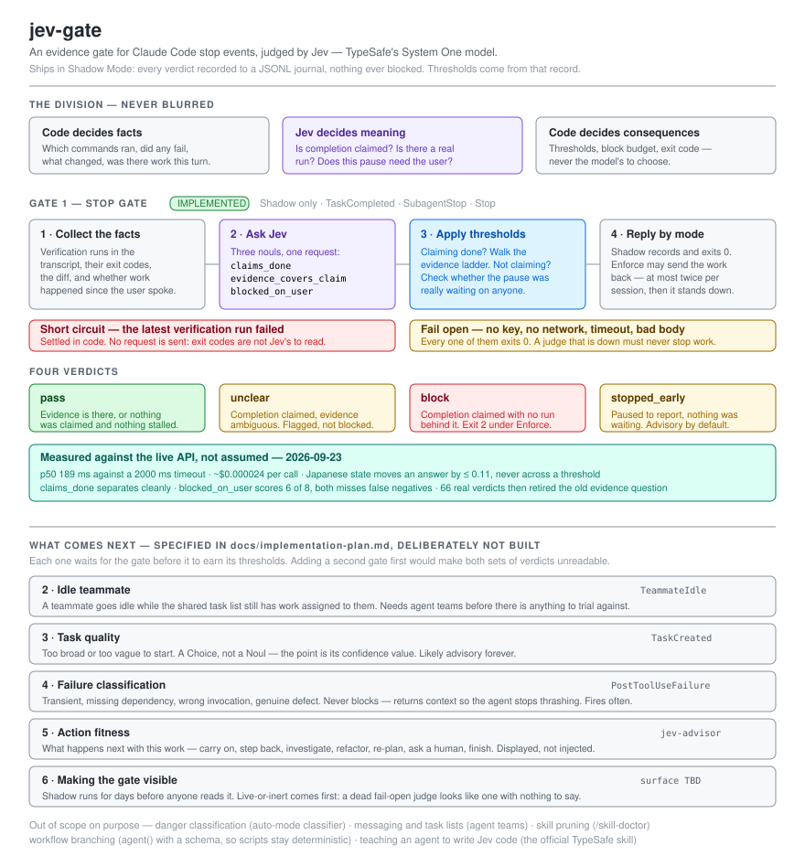

# jev-gate

A stop-event gate for Claude Code. When an agent stops, jev-gate asks what kind of stop it is — *is this completion claim backed by an actual run?* and *did this pause really need you?* — and answers with [Jev](https://docs.typesafe.ai/introduction), TypeSafe's System One model, at a few thousandths of a cent per check.

```
/plugin install jev-gate
```

It ships in **Shadow Mode**: every verdict is recorded, nothing is ever blocked. Thresholds are meant to be chosen from that record, not guessed up front.

<p align="center">
  
</p>

## The two stops worth catching

Anthropic's Opus 5.5 playbook names both failure modes, and they are not the same shape:

- **Completion without evidence.** The advice for subagent reports is "check its evidence before you accept it." An agent that says the tests pass without running them is the obvious case.
- **Pausing to report instead of going on.** The playbook describes it precisely: *"a summary that names the next step without taking it, an offer to continue, or a list of choices that don't block the work."* In long-running work this is the more common one — and a gate that only watches for false completion claims lets every bit of it through.

jev-gate checks for both on the same events, because both arrive as a stop.

## Why a separate judge

A generating model asked to grade its own output is doing two jobs with one set of weights. Jev does one job: it takes state and returns typed, calibrated probabilities — no prose, no tool calls, no way to return a value outside the schema. That makes it cheap enough to sit on every stop event, and narrow enough that the interesting logic stays in code where it can be read.

The division is strict:

- **Code decides facts.** Which commands ran, whether they exited non-zero, whether anything was edited or run since the user last spoke.
- **Jev decides meaning.** Whether a message claims completion; whether a log holds a real verification run; whether a pause is actually waiting on the user.
- **Code decides what happens.** Thresholds, block budgets, and the exit code are never the model's to choose.

## Features

- **Completion gate (hook)** — fires on `TaskCompleted`, `SubagentStop` and `Stop`. A verification run that failed and was never re-run, and a completion claim with nothing run behind it at all, are both caught by code alone. Jev is asked only what code cannot count: whether what ran actually covers what is being claimed.
- **Early-stop detection** — distinguishes a legitimate check-in from a task that stalled into a status report. Advisory by default; the playbook's own remedy for this is a CLAUDE.md rule, not a hard stop.
- **Shadow Mode by default** — every verdict exits 0 and lands in a JSONL journal alongside the probabilities that produced it.
- **Fail-open, without exception** — no API key, no network, a slow response, a malformed body, an unexpected exception: every one of those exits 0. A judge that is down never stops work.
- **Block budget** — a session can be sent back at most twice, then the gate stands down and the human decides.
- **One journal for every gate and every project** — because thresholds can only be set from a distribution, and a distribution split across projects is not one.

## Commands

| Command | Purpose |
|---|---|
| `/jev-gate:status [gate]` | Verdict distribution, probability histograms, latency percentiles and token spend — then a threshold recommendation drawn from the histogram, not from intuition. |
| `/jev-gate:mode [shadow\|enforce\|off]` | Show the resolved mode and its source layer, or write a new one to `.jev-gate/config.json`. Refuses to recommend Enforce on a thin journal. |
| `/jev-gate:doctor` | Print the resolved configuration and send one small real request. Reports latency, serving model and token usage. Never prints the key. |

## Setup

jev-gate needs an API key in the environment. It is read at hook time and never written to the journal or printed by any command.

```bash
export TYPESAFE_API_KEY=...    # in your shell profile, not in a config file
```

Without it the plugin installs and runs, but every event fails open — `/jev-gate:doctor` says so in as many words.

`TaskCompleted` additionally requires `CLAUDE_CODE_ENABLE_TODO_TOOLS=1`. Without it that event never fires and only `SubagentStop` and `Stop` are live.

## How the gate decides

```
agent stops
  │
  ├─ code: walk the transcript for verification runs (test / build / lint / typecheck)
  │        latest run of any of them errored?  ──yes──▶  block         (no request sent)
  │        no final message at all?            ──yes──▶  pass
  ▼
  Jev: three nouls, one request
       claims_done           — the final message reports something completed
       evidence_covers_claim — what ran exercises what is being claimed
       blocked_on_user       — the stop needs a decision only the user can give
  ▼
  code:  claims_done ≥ 0.5
           nothing ran at all           ──▶ block   (a count, so code decides)
           evidence_covers_claim ≥ 0.7  ──▶ pass
           evidence_covers_claim ≥ 0.3  ──▶ unclear
           otherwise                    ──▶ block
         claims_done < 0.5
           work happened this turn, and blocked_on_user < 0.5
                                   ──▶ stopped_early
           otherwise               ──▶ pass
  ▼
  shadow  → record everything, exit 0
  enforce → pass: exit 0 · unclear: systemMessage · block: exit 2, budget 2
            stopped_early: systemMessage (exit 2 only if opted in)
```

`workThisTurn` — did the agent edit or run anything since the user last spoke — is what keeps an ordinary answered question out of the early-stop branch. A turn that changed nothing is a conversation, not a task that stalled. It is read from the transcript by code, never inferred.

Asking whether a run *exists* was the original mistake: that is a count, and code has it. The question that earns its cost is whether the run **reaches** what was claimed — one test file passing does not support "every endpoint is migrated". Success or failure is not asked either, for the same reason: the exit code is a fact, and a failed run short-circuits long before Jev is called.

All three questions are phrased **positively**. jev-1.13 reads negations at face value, so anything absent is computed in code — an `evidence_missing` question is exactly the shape to avoid. For the same reason the gate never asks whether the tests *passed*: counting and arithmetic are documented weaknesses, and the exit code is already sitting in the transcript.

When the hook event carries the task's own text, it goes into the state as `task`. The playbook's advice is to name the finish line per task — *"done means: every endpoint uses the new client, the old client is deleted, and the test suite passes"* — and evidence judged against that beats evidence judged against a generic notion of "some test ran".

## Configuration

Layers, later winning: the plugin default → `<plugin data dir>/config.json` → `<project>/.jev-gate/config.json` → environment.

```json
{
  "mode": "shadow",
  "model": "jev-1.13.0",
  "timeoutMs": 2000,
  "gates": {
    "completion": {
      "enabled": true,
      "thresholds": {
        "claimsDone": 0.5, "evidencePass": 0.7, "evidenceBlock": 0.3, "blockedOnUser": 0.5
      },
      "earlyStop": { "enabled": true, "action": "notify" },
      "verificationCommands": [],
      "maxBlocksPerSession": 2
    }
  }
}
```

`mode` is global; `gates.<name>.enabled` is per gate, so switching to Enforce never silently activates a gate that was never trialled.

**`verificationCommands`** takes regex sources matched against Bash commands, on top of the built-in list of common runners. A project with its own script needs this, or the gate reads a custom runner as an absence of evidence:

```json
{ "gates": { "completion": { "verificationCommands": ["\\./scripts/verify", "\\bbazel test\\b"] } } }
```

**`earlyStop.action`** is `"notify"` by default. Set it to `"block"` to have Enforce actually push the agent onward with exit 2 — worth doing only once the journal shows the detection is accurate on your work.

Set `journal` only to put the log somewhere specific; left unset it follows the plugin's data directory, so an install that moves does not strand its own history.

Environment overrides: `JEV_GATE_MODE`, `JEV_GATE_DISABLE=1` (everything off for one session), `JEV_GATE_JOURNAL`.

## What lands on disk, and what to commit

jev-gate writes to the directory Claude Code gives every plugin for its own state — `~/.claude/plugins/data/jev-gate-<marketplace>/`, which `CLAUDE_PLUGIN_DATA` points at. The journal lands there as `journal.jsonl`, with a per-session block counter under `sessions/`. Nothing is created in a project unless you put it there.

The one thing you *do* create in a project is its config, and it is meant to be committed — thresholds, mode and `verificationCommands` are project policy, and a teammate who clones the repo should get the same gate you have:

```
.jev-gate/config.json     commit this
```

If you point `JEV_GATE_JOURNAL` at a path inside the repo, ignore it — a journal is a local record, not shared policy:

```gitignore
.jev-gate/*.jsonl
```

**What a journal entry contains.** Verdict, the probabilities and thresholds behind it, command count, latency, token usage, the session id and the `cwd`. Transcript text is *not* recorded — neither the agent's message nor command output. The single exception is the `recorded_failure` path, which stores the failing command verbatim so you can see what was being checked. If your verification commands carry secrets inline (`TOKEN=... npm test`), that string reaches the journal, so keep the journal out of the repo and out of anything you share.

## Measured, not assumed

Verified against the live API on 2026-09-23 (`jev-1.13.0`):

| | |
|---|---|
| Latency | p50 189 ms, max 332 ms — the 2000 ms default has ~6× margin |
| Cost | 548–624 input tokens per call, about \$0.000024; larger command logs raise it |
| Japanese `state` | Same fixtures in Japanese and English moved by ≤ 0.11 and never crossed a threshold |
| `claims_done` | Cleanly separated — values sat at the extremes, not in the middle |
| `blocked_on_user` | **6 of 8** hand-written fixtures |

Then 66 real verdicts from a working project said something the fixtures could not: the old `evidence_present` question agreed with `commandCount > 0` **66 times out of 66** — 0.02 whenever nothing had run, 0.98–0.99 whenever something had, never a value in between. It was buying a fact code already had. v0.4.0 replaced it; see the changelog.

**The `blocked_on_user` miss is worth knowing before you rely on it.** An explicit request for permission — *"次は refunds です。続けますか？"*, *"shall I commit and move on?"* — scores high and is read as a legitimate stop, so early-stop detection stays quiet. jev-1.13 reads the question literally, which it plainly is. Four rewordings and a two-question decomposition were tried; the decomposition fixed these two and broke two others, so the original wording stands rather than being overfitted to eight invented examples.

Both misses are **false negatives**: the gate under-reports rather than wrongly pushing an agent onward. Nothing that genuinely needed the user was flagged as a stall. That is the direction to fail in, and a further reason `stopped_early` is advisory by default.

## Getting to Enforce

1. **Shadow.** Install, set the key, work normally. Verdicts accumulate; nothing changes.
2. **Compare.** Run `/jev-gate:status`. Read the histograms and spot-check the entries whose verdict you would have decided differently. This step is the point of the whole design — thresholds chosen without it are guesses wearing a number.
3. **Enforce.** Set thresholds from the distribution, then `/jev-gate:mode enforce`.

`/jev-gate:status` counts each branch separately, because a probability only informs a threshold when the branch it governs was actually taken:

```
--- progress towards Enforce ---
  coverage ladder reached      3 / 30
  early-stop branch taken     41 / 30
  (answers returned but unused: 22 coverage)
```

The two fill at very different rates and are ready at different times. Turn them on separately.

## Relationship to the CLAUDE.md stop rule

The playbook's recommended rule is worth having regardless of this plugin:

> When a step doesn't need my input, keep going. Put status notes in the same message as your next action. Stop and ask only when you can't continue without me, or before anything destructive: deleting data, force-pushing, or changing anything outside this repository.

That rule is instruction; jev-gate is measurement. The rule tries to prevent the stop, the journal tells you how often it still happened. They are complements, and the gate never argues with the destructive-action half of the rule — it has no opinion on stops that are waiting for approval, which is exactly what `blocked_on_user` is there to recognise.

## What this plugin deliberately does not do

Danger classification belongs to Claude Code's auto-mode classifier; messaging and shared task lists to the official agent-teams features; skill pruning to `/skill-doctor`; workflow branching to `agent()` with a `schema`, since workflow scripts must stay deterministic and an external API call inside one would break re-runs.

Teaching an agent how to *write* Jev code is also a different job, already covered by the official TypeSafe agent skill (`npx skills add typesafe-ai/skills --skill typesafe-ai`). The two complement each other and are not meant to overlap.

## Roadmap

Further gates are specified in [`docs/implementation-plan.md`](docs/implementation-plan.md) and deliberately not built — each one waits for the gate before it to earn its thresholds:

- **Idle teammate** (`TeammateIdle`) — the team-shaped remainder of early-stop detection, now that the single-session case is handled here.
- **Task quality** (`TaskCreated`) — a task too broad or too vague to start.
- **Failure classification** (`PostToolUseFailure`) — transient vs. missing dependency vs. genuine defect, injected as context rather than as a block.
- **Approach advice** (`UserPromptSubmit`) — which execution vessel suits a request. Not a gate, and likely a separate plugin if it is built at all.

## Changelog

### v0.7.0

- **v0.6.0 fixed the message but not the facts.** The command log still came from `transcript_path`, which on `SubagentStop` is the parent's — so a subagent's claim was judged against the orchestrator's commands. Of the first 29 decisive rows afterwards, **every coverage value fell below 0.3 and every verdict was a block**, with all 13 named-subagent rows showing the same `commandCount=2`.
- A subagent's own transcript sits at `<projects>/<session>/subagents/agent-<agent_id>.jsonl`. `SubagentStop` now reads it. The layout is undocumented, so it is best-effort: missing means stand down (`subagent_facts_unavailable`), never fall back to the parent.
- **Retraction:** the earlier finding that neither project contained an implementer session was wrong. It was drawn from parent transcripts; one `alpha-implementer` subagent's own transcript holds 54 Edits, 5 Writes and 123 Bash calls. The sessions this gate was designed for were there all along, in the files it was not reading.

### v0.6.0

- **The final message now comes from `last_assistant_message`, not the transcript.** Claude Code's hook docs say the transcript file lags the live conversation and that Stop and SubagentStop hooks should use that field instead. This gate had been reading the file since v0.1.0.
- **On `SubagentStop` the transcript belongs to the parent session** — subagent turns are never written to it. Every SubagentStop verdict was therefore about the orchestrator's last message rather than the subagent's report. That is **188 of 310 entries, 61% of everything collected so far**, and it is the one thing the hook existed to do.
- Where the event hands no message over, `Stop` falls back to the transcript (merely stale) and `SubagentStop` stands down, recording `subagent_message_unavailable` — a wrong agent is worse than no answer.
- Each verdict records `msgSource`, `agentType` and `msgDiffers`, so the next batch settles what this release had to infer.
- **Every accuracy figure reported before this release was measured through the transcript** and describes the wrong agent in the majority of cases.

### v0.5.0

- **`claims_done` reworded.** It asked whether "the requested work" was finished; in a session that delegates step after step, a step finishing is not that, and jev-1.13 read it exactly that literally. Reading 33 real `stopped_early` verdicts back against their messages, 11 were plain completion announcements — `## 移行完了 ✅`, `ジャーナル統合が完了しました` — scoring 0.03–0.47 and landing in the early-stop branch. Precision was 39–67%.
- The replacement was chosen by measuring four wordings **on those same messages**, scoring both the completions it had to start catching and the early stops it must not break: 4/8 → 8/8 on the first, 10/10 → 8/10 on the second. The two it gives up both do report something finished.
- The fault was never in `blocked_on_user`, which answered correctly every time — nobody was waiting on those messages.
- Side effect: more messages now clear `claims_done` and reach the coverage ladder, which had been starved at 3 samples.

### v0.4.1

- **Count the rows a number actually decided.** `/jev-gate:status` now separates each probability's decisive rows — the ones whose branch was taken — from every answer returned, and prints per-branch progress towards Enforce. The old "≥ 30 Jev-decided entries" criterion used the wrong denominator: on the first v0.4.0 data, 24 coverage answers came back and 3 of them decided anything.
- The looser count was also hiding a result. Restricted to rows where it was decisive, `blocked_on_user` separates cleanly — 33 below 0.3, none between 0.3 and 0.6, 8 above — where the pooled view had shown a cluster straddling the threshold.

### v0.4.0

- **`evidence_present` replaced by `evidence_covers_claim`.** Over 66 real verdicts the old question matched `commandCount > 0` every single time, so it was spending a request on a fact code already held — the thing design rule 1 exists to prevent. Whether anything ran is now decided in code; Jev is asked whether what ran covers the claim.
- The `unclear` verdict becomes reachable. Under the old question nothing ever landed between 0.3 and 0.7, so both thresholds were untested.
- A claim with no runs behind it is recorded as `decidedBy: "code"`, `reason: "no_runs"`, and excluded from the coverage histogram — the model still answers a question with no subject, and that answer must not reach the numbers thresholds are read from.
- `/jev-gate:status` never pools the two questions into one histogram; pre-v0.4.0 entries are counted and set aside.

### v0.3.0

- **Storage moved.** The journal and the block counters now live in the per-plugin data directory Claude Code provides (`CLAUDE_PLUGIN_DATA`, i.e. `~/.claude/plugins/data/jev-gate-<marketplace>/`), as Claude Code's own first-party plugins do. Earlier versions wrote to `~/.claude/jev-gate/`, which squatted in Claude Code's namespace.
- Nothing is moved on your behalf. `/jev-gate:status` reads the old location too, so no sample is lost, and `/jev-gate:doctor` prints the one command that finishes the move.
- The journal path is no longer pinned in the shipped config: unset, it follows the plugin's data directory.
- Each verdict records whether `CLAUDE_PLUGIN_DATA` was actually present, so the assumption is checked against real runs.

### v0.2.5

- Add an overview diagram to the README: the division of labour, the implemented stop gate and its four verdicts, the measured numbers, and the five gates that are specified but not built.

### v0.2.4

- Survey the surfaces for making Shadow Mode visible at a glance — `statusLine` fragment, `SessionStart` injection, a command, a published page — with what each can and cannot carry, rather than committing to one.

### v0.2.3

- Revise the status-line sketch and reframe gate 5 in the implementation plan, drawing on a published Jev harness: show connection state and model continuously, show probabilities rather than tallies, and treat "not measured yet" as distinct from zero.

### v0.2.2

- Verify the request and response shapes, latency, cost, and question quality against the live API rather than a mock; record the numbers in the README and the implementation plan.
- Correct the cost claim: measured \$0.000024 per call, not "roughly a hundredth of a cent".
- Document the `blocked_on_user` miss — an explicit request for permission reads as a legitimate stop — and that all observed errors are false negatives.
- Sketch a status-line fragment in the implementation plan.

### v0.2.1

- Document what jev-gate writes to disk, which file belongs in version control (`.jev-gate/config.json`) and which does not, and exactly what a journal entry contains — including the one path that records a command verbatim.

### v0.2.0

- Add early-stop detection: a third noul (`blocked_on_user`) separates a legitimate check-in from a task that stalled into a status report. Advisory by default; `earlyStop.action: "block"` opts into exit 2.
- Add `verificationCommands` so a project's own runner is not mistaken for an absence of evidence — this was the known gap in v0.1.0.
- Include the task's own definition of done in the state when the hook event carries it.
- `/jev-gate:status` reports the `blocked_on_user` histogram over work turns only.

### v0.1.0

- Initial release. Completion gate on `TaskCompleted` / `SubagentStop` / `Stop`, Shadow Mode only. `/jev-gate:status`, `/jev-gate:mode`, `/jev-gate:doctor`. Implementation plan for gates 2–5.
